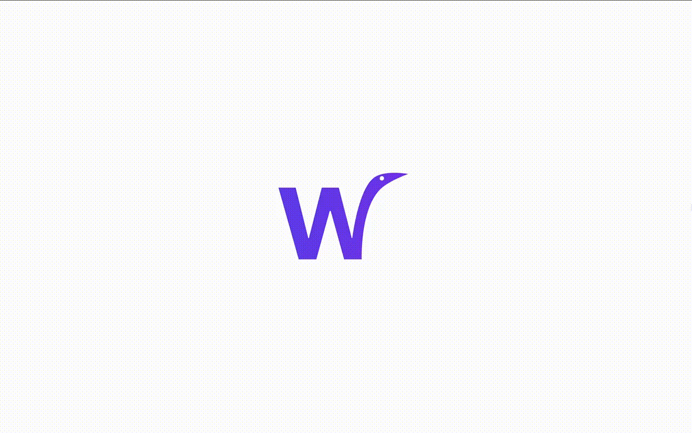
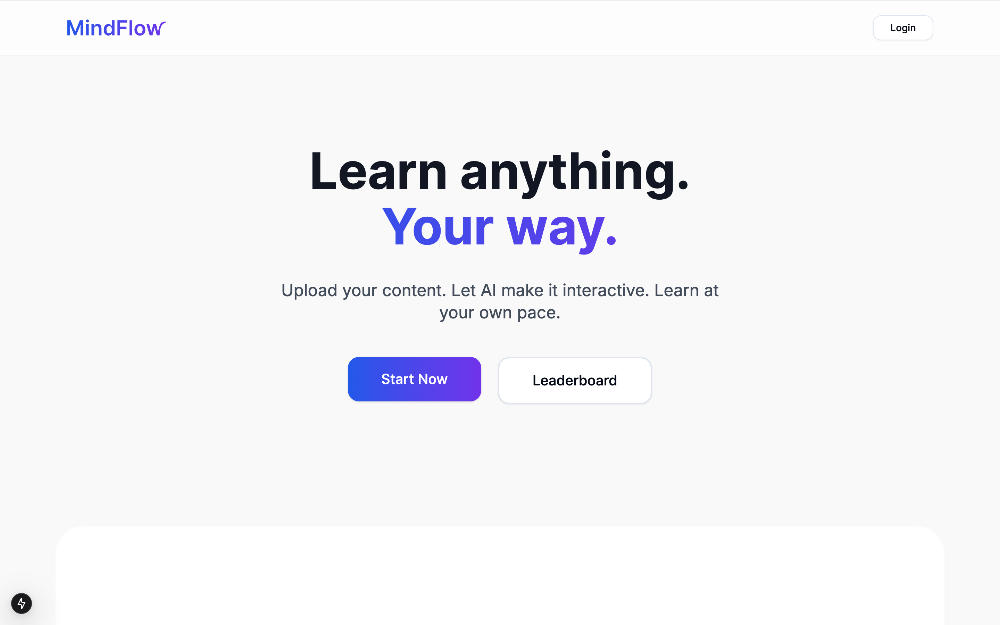

# MindFlow

## Overview

MindFlow is an **adaptive learning companion** that personalises education by tailoring content based on user feedback and performance. By leveraging **AI-driven content generation**, MindFlow transforms learning resources into **interactive modules**, making education more engaging and accessible.

MindFlow supports multiple modalities—including **interactive quizzes**—to match individual learning styles. It dynamically adjusts **difficulty and presentation** in real time, ensuring users always learn at the right pace. Additionally, MindFlow prevents misinformation, enhances accessibility with **text-to-speech and speech-to-text**, and even aids in **decision-making** by providing contextual insights.

## Features

- 📂 **Upload & Convert Resources** – Users can upload PDFs, slides, and videos, which are then transformed into structured learning materials.
- 🧠 **AI-Powered Concept Understanding** – Analyses documents and extracts key concepts to generate concise summaries, flashcards, and quizzes.
- 🎯 **Adaptive Learning Paths** – Dynamically adjusts difficulty and presentation based on user performance and feedback.
- ✍️ **Interactive Quizzes** – Reinforces learning with AI-generated quizzes and condensed study material.
- 🔎 **Retrieval-Augmented Generation (RAG)** – Provides accurate, contextual information by pulling from verified sources.
- 🎮 **Gamification Elements** – Keeps users engaged with achievements and progress tracking.
- 🎙️ **Multimodal AI Accessibility** – Supports **text-to-speech, speech-to-text**, and multimodal interactions for enhanced accessibility.
- 🤖 **Decision Support & Information Integrity** – Assists in research and analysis while mitigating misinformation.

## Tech Stack

- **Frontend:** React, Next.js
- **Backend:** Flask
- **AI & NLP:** Custom RAG pipeline, OpenAI, in-house text-to-speech & speech-to-text
- **Integrations:** LangChain, Hugging Face

## Demo Video

## What’s Next for MindFlow?

As we continue improving MindFlow, we aim to introduce even more **intelligent features and enhancements**, including:

- 🌍 **Multilingual Support** – Expanding accessibility for a global audience.
- 🤝 **Collaborative Learning Features** – Enabling group study sessions and shared learning experiences.
- 🎨 **Customisable Learning Environments** – Allowing users to tailor UI themes and interaction modes.
- 🕵️ **Advanced Research Tools** – Enhancing document analysis with deeper contextual insights.
- 📊 **Analytics & Learning Insights** – Providing in-depth progress tracking and performance analytics.
